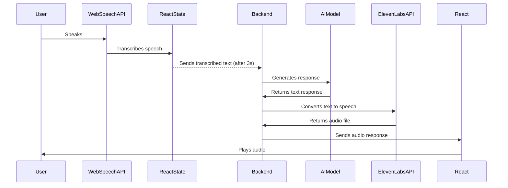

# Voice Chat Web Application

## Overview

This project also includes a backend service built with Node.js and Express, which handles text processing, integrates with an AI model (Gemma2:2b), and converts responses into speech using Eleven Labs API.

This is a React-based web application that captures user voice input, converts it into text, and sends it to a backend for processing. The backend generates an audio response, which is then played back to the user. The application leverages the Web Speech API for speech recognition and Axios for HTTP requests.

## Features

- **Voice Recognition**: Captures user speech and transcribes it into text.
- **Debounced Request**: Ensures that the request is sent only after the user stops speaking for a short period.
- **Backend Integration**: Sends the transcribed text to a backend endpoint (`/chat`).
- **Audio Playback**: Plays the response audio received from the backend.

## Technologies Used

### Frontend
- **React**: Frontend framework
- **Web Speech API**: Handles speech recognition
- **Axios**: Manages HTTP requests
- **HTML5 Audio API**: Plays the audio response

### Backend
- **Node.js & Express**: API server for processing requests
- **MongoDB**: Database to store character information
- **Axios**: Used for AI and speech processing API requests
- **Ollama AI Model (Gemma2:2b)**: Generates responses based on user input
- **Eleven Labs API**: Converts text responses into speech
- **Redis**: Caching system to optimize performance

- **React**: Frontend framework
- **Web Speech API**: Handles speech recognition
- **Axios**: Manages HTTP requests
- **HTML5 Audio API**: Plays the audio response

## Installation

### Prerequisites

- Node.js and npm installed
- A backend service running at `http://localhost:3000/chat`

### Steps to Run

1. Clone the repository:
   ```sh
   git clone <repository-url>
   cd <project-folder>
   ```
2. Install dependencies:
   ```sh
   npm install
   ```
3. Start the application:
   ```sh
   npm start
   ```

## Usage

1. Click the **"🎤 Press to Speak"** button.
2. Speak into your microphone; the app will transcribe your speech in real time.
3. After 3 seconds of inactivity, the text will be sent to the backend.
4. The backend will return an audio response, which will be played automatically.

## Sequence Diagram



## Code Explanation

### Backend Implementation

#### Express Server (`server.ts`)
This file sets up the Express server and listens on port 3000:
```ts
import app from "./app";
import dotenv from "dotenv";

dotenv.config();

const PORT = 3000;
app.listen(PORT, () => {
    console.log(">> SERVER RUNNING ON PORT >>>", PORT);
});
```

#### Express Application (`app.ts`)
Sets up middleware, connects to MongoDB, and loads routes:
```ts
import express from "express";
import cors from "cors";
import mongoose from "mongoose";
import chatRoutes from "./routes/chat";

dotenv.config();
const app = express();

app.use(cors());
app.use(express.json());
app.use("/chat", chatRoutes);
app.use("/audio", express.static("public/audio"));

mongoose.connect("mongodb://chatbot-db:27017/chatbot").then(() => {
    console.log("DB connected !!!");
}).catch(err => console.log("Error connecting to DB", err));

export default app;
```

#### Chat Route (`chat.ts`)
Handles incoming chat messages and queries character data:
```ts
router.post("/", async (req: Request, res: Response) => {
  const { prompt } = req.body;
  try {
    const character_data = await character.findOne({ name: new RegExp(normalizeText("joaquin suarez"), "i") });
    const context = character_data ? character_data : "Not found information!";
    const responseText = await getOllamaResponse(prompt, context);
    res.status(200).json(responseText);
  } catch (err) {
    console.log(">> ERROR ON ROUTE", err);
    res.status(500).json({ error: "Error processing request" });
  }
});
```

### `useEffect` for Debounce

This ensures that the request is sent **only after 3 seconds of inactivity**:

```tsx
useEffect(() => {
  if (keyword && keyword.length > 0) {
    const debounceTimer = setTimeout(async () => {
      try {
        const response = await axios.post("http://localhost:3000/chat", { prompt: keyword });
        setResponse(response?.data?.audio);
      } catch (error) {
        console.error("❌ Error sending the request:", error);
      }
    }, 3000);
    return () => clearTimeout(debounceTimer);
  }
}, [keyword]);
```

### Speech Recognition

The Web Speech API listens for user input and updates the `keyword` state with transcribed text:

```tsx
const startListening = () => {
  const SpeechRecognition =
    (window as any).SpeechRecognition || (window as any).webkitSpeechRecognition;

  if (!SpeechRecognition) {
    alert("❌ Your browser does not support speech recognition.");
    return;
  }

  const recognition = new SpeechRecognition();
  recognition.lang = "es-ES";
  recognition.interimResults = true;
  recognition.continuous = false;

  recognition.onresult = (event: any) => {
    const transcript = event.results[0][0].transcript;
    setKeyword(transcript);
  };

  recognition.onerror = (event: any) => {
    console.error("❌ Speech recognition error:", event);
    setIsListening(false);
  };

  recognition.onend = () => {
    setIsListening(false);
  };

  recognition.start();
};
```

## Future Improvements

- Support for multiple languages.
- Improve error handling.
- Implement real-time streaming responses.

## License

This project is licensed under the MIT License.

